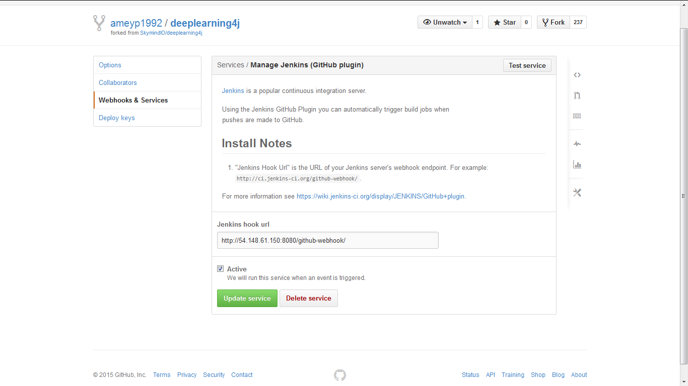
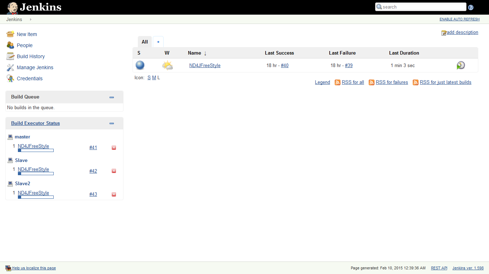
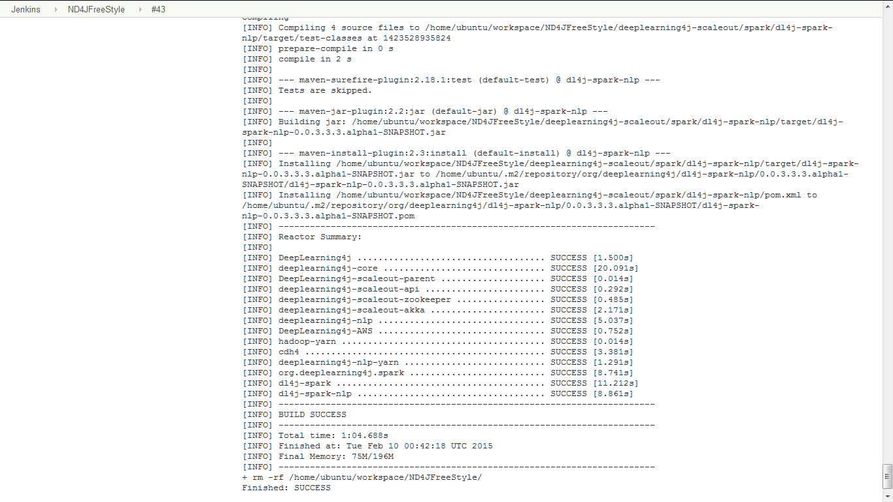

a

#DevOps

##Project MileStone 1
##Build

We have used Amazon EC2 with Jenkins for implementing the Build Server.

####Configuration####

***Image  :*** Ubuntu 14.04 with Open-JDK

***JDK     :*** java version "1.7.0_75"

***Maven :*** Apache Maven 3.0.5

***Git       :*** git version 1.9.1


####Setup####

We have configured a 1 Master - 2 Slave Setup for a Java Maven Project.

Dependency Manager and Build - Maven

####Repository####

The repository being used is the deeplearning4j repository used in class for the build server workshop:

https://github.com/ameyp1992/deeplearning4j.git

We are using Maven for building the project. 

Maven executes the pom.xml file located in the repository’s parent folder.

##Jenkins Master Setup:

**Step 1) Configuration:**

We have configured Jenkins Master via the UI.

The config file is as follows:

```
ubuntu@ip-172-31-46-200:/var/lib/jenkins$ cat config.xml
<?xml version='1.0' encoding='UTF-8'?>
<hudson>
  <disabledAdministrativeMonitors>
    <string>hudson.node_monitors.MonitorMarkedNodeOffline</string>
    <string>hudson.diagnosis.ReverseProxySetupMonitor</string>
    <string>jenkins.diagnostics.SecurityIsOffMonitor</string>
  </disabledAdministrativeMonitors>
  <version>1.598</version>
  <numExecutors>1</numExecutors>
  <mode>NORMAL</mode>
  <useSecurity>true</useSecurity>
  <authorizationStrategy class="hudson.security.AuthorizationStrategy$Unsecured"/>
  <securityRealm class="hudson.security.SecurityRealm$None"/>
  <disableRememberMe>false</disableRememberMe>
  <projectNamingStrategy class="jenkins.model.ProjectNamingStrategy$DefaultProjectNamingStrategy"/>
  <workspaceDir>${JENKINS_HOME}/workspace/${ITEM_FULLNAME}</workspaceDir>
  <buildsDir>${ITEM_ROOTDIR}/builds</buildsDir>
  <jdks>
    <jdk>
      <name>Default</name>
      <home>/usr/lib/jvm/java-7-openjdk-amd64</home>
      <properties/>
    </jdk>
  </jdks>
  <viewsTabBar class="hudson.views.DefaultViewsTabBar"/>
  <myViewsTabBar class="hudson.views.DefaultMyViewsTabBar"/>
  <clouds/>
  <slaves>
    <slave>
      <name>Slave</name>
      <description></description>
      <remoteFS>/home/ubuntu</remoteFS>
      <numExecutors>1</numExecutors>
      <mode>NORMAL</mode>
      <retentionStrategy class="hudson.slaves.RetentionStrategy$Always"/>
      <launcher class="hudson.plugins.sshslaves.SSHLauncher" plugin="ssh-slaves@1.9">
        <host>172.31.45.63</host>
        <port>22</port>
        <credentialsId>8d634b46-c867-4a6f-8018-406056dbd31b</credentialsId>
        <maxNumRetries>0</maxNumRetries>
        <retryWaitTime>0</retryWaitTime>
      </launcher>
      <label></label>
      <nodeProperties/>
      <userId>anonymous</userId>
    </slave>
    <slave>
      <name>Slave2</name>
      <description></description>
      <remoteFS>/home/ubuntu</remoteFS>
      <numExecutors>1</numExecutors>
      <mode>NORMAL</mode>
      <retentionStrategy class="hudson.slaves.RetentionStrategy$Always"/>
      <launcher class="hudson.plugins.sshslaves.SSHLauncher" plugin="ssh-slaves@1.9">
        <host>172.31.36.202</host>
        <port>22</port>
        <credentialsId>8d634b46-c867-4a6f-8018-406056dbd31b</credentialsId>
        <maxNumRetries>0</maxNumRetries>
        <retryWaitTime>0</retryWaitTime>
      </launcher>
      <label></label>
      <nodeProperties/>
      <userId>anonymous</userId>
    </slave>
  </slaves>
  <quietPeriod>5</quietPeriod>
  <scmCheckoutRetryCount>0</scmCheckoutRetryCount>
  <views>
    <hudson.model.AllView>
      <owner class="hudson" reference="../../.."/>
      <name>All</name>
      <filterExecutors>false</filterExecutors>
      <filterQueue>false</filterQueue>
      <properties class="hudson.model.View$PropertyList"/>
    </hudson.model.AllView>
  </views>
  <primaryView>All</primaryView>
  <slaveAgentPort>0</slaveAgentPort>
  <label></label>
  <nodeProperties/>
  <globalNodeProperties/>


```

**Step 2) Install the Jenkins plugins:**

<ul> <li> GitHub Plugin → for configuring github hooks </li>

<li>Slave Setup → for auto configuring the slaves on connecting to master.</li>
</ul>

**Step 3) Setup the Jenkins Job:**

We have setup a free style Jenkins Job with a hook to the GitHub Repository.

**Build Trigger:**

Build when a change is pushed to GitHub

**Shell Command to Build the Project:**
```
if [ -d "/var/lib/jenkins/workspace/ND4JFreeStyle" ]; then
                cd /var/lib/jenkins/workspace/ND4JFreeStyle
else
                cd /home/ubuntu/workspace/ND4JFreeStyle
fi

mvn clean install -DskipTests -Dmaven.javadoc.skip=true
rm -rf /home/ubuntu/workspace/ND4JFreeStyle/      			## Clean the directory post build


```

##Slave Setup:

<ol> 
<li> We have used the Slave Setup plugin to install git and maven automatically when a slave connects to the master. </li>
<li>We have created a setup.sh file on the master that gets copied and executed on the slave as a part of the launch initialization process (slave).</li>
</ol>
```
ubuntu@ip-172-31-46-200:~/SlaveSetup$ cat setup.sh
sudo apt-get -y update
sudo apt-get install maven -y
sudo apt-get install git -y

```

**GitHub Hook:**

**Screenshot:**



**Config.xml for the Auto Build Job:**

```
ubuntu@ip-172-31-46-200:/var/lib/jenkins/jobs/ND4JFreeStyle$ cat config.xml
<?xml version='1.0' encoding='UTF-8'?>
<project>
  <actions/>
  <description></description>
  <keepDependencies>false</keepDependencies>
  <properties>
    <com.coravy.hudson.plugins.github.GithubProjectProperty plugin="github@1.10">
      <projectUrl>https://github.com/ameyp1992/deeplearning4j.git/</projectUrl>
    </com.coravy.hudson.plugins.github.GithubProjectProperty>
  </properties>
  <scm class="hudson.plugins.git.GitSCM" plugin="git@2.3.4">
    <configVersion>2</configVersion>
    <userRemoteConfigs>
      <hudson.plugins.git.UserRemoteConfig>
        <url>https://github.com/ameyp1992/deeplearning4j.git</url>
      </hudson.plugins.git.UserRemoteConfig>
    </userRemoteConfigs>
    <branches>
      <hudson.plugins.git.BranchSpec>
        <name>*/master</name>
      </hudson.plugins.git.BranchSpec>
    </branches>
    <doGenerateSubmoduleConfigurations>false</doGenerateSubmoduleConfigurations>
    <submoduleCfg class="list"/>
    <extensions/>
  </scm>
  <canRoam>true</canRoam>
  <disabled>false</disabled>
  <blockBuildWhenDownstreamBuilding>false</blockBuildWhenDownstreamBuilding>
  <blockBuildWhenUpstreamBuilding>false</blockBuildWhenUpstreamBuilding>
  <triggers>
    <com.cloudbees.jenkins.GitHubPushTrigger plugin="github@1.10">
      <spec></spec>
    </com.cloudbees.jenkins.GitHubPushTrigger>
  </triggers>
  <concurrentBuild>true</concurrentBuild>
  <builders>
    <hudson.tasks.Shell>
      <command>if [ -d &quot;/var/lib/jenkins/workspace/ND4JFreeStyle&quot; ]; then
                cd /var/lib/jenkins/workspace/ND4JFreeStyle

else
                cd /home/ubuntu/workspace/ND4JFreeStyle
fi

mvn clean install -DskipTests -Dmaven.javadoc.skip=true
rm -rf /home/ubuntu/workspace/ND4JFreeStyle/</command>
    </hudson.tasks.Shell>
  </builders>
  <publishers/>
  <buildWrappers/>

```

**Screenshot of Concurrent Builds:**



**Slave Status Log:**




##Status of Build##

We are using Jenkins for build server setup. Therefore we can directly access the status of the master and slave nodes via the Jenkins Dahsboard. Below are the links to view the status of specific Nodes.

**Jenkins master IP:** http://54.148.61.150:8080/

**Slave 1 DashBoard:** http://54.148.61.150:8080/computer/Slave/

**Slave 2 DashBoard:** http://54.148.61.150:8080/computer/Slave2/


To view the Build Status/History for the Build Job we can use the following Link

**Build Status:** http://54.148.61.150:8080/job/ND4JFreeStyle/


  


